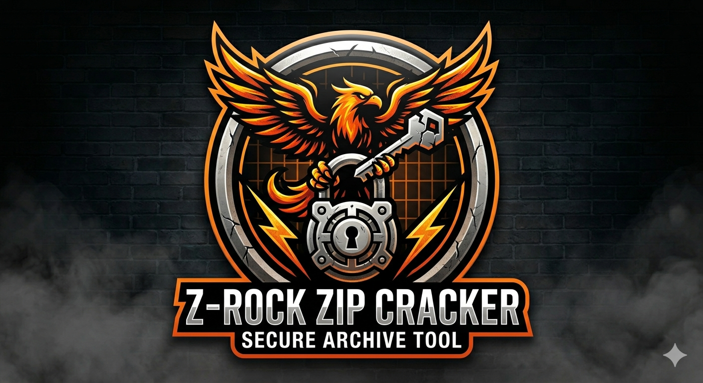

# ⚡ Z-ROCK: Advanced Multi-Threaded ZIP Recovery Suite

<div align="center">
  
  <br>
  
  [](https://python.org)
  [](https://github.com/YourUsername/Z-ROCK)
  [](#)
  [](https://opensource.org/licenses/MIT)
  
  <p align="center"><b>Industrial-grade performance. Minimalist design. Built for speed.</b></p>
</div>

---

## 💎 Why Z-ROCK?
Most ZIP crackers are slow because they use a single CPU thread. **Z-ROCK** is engineered with **asynchronous multi-threading**, allowing it to test thousands of passwords per second without overheating your device—even on **Termux**.

---

## 🚀 Pro Features
| Feature | Description |
| :--- | :--- |
| ⚡ **Turbo Core** | Uses all available CPU cores for parallel processing. |
| 🛡️ **Stealth Mode** | Optimized memory management to prevent system lag. |
| 📊 **Real-time Progress** | Dynamic progress bars showing speed (keys/sec). |
| 🐍 **Pythonic** | Written in clean, modular Python 3 for easy customization. |
| 📱 **Termux Native** | Optimized specifically for Android's resource constraints. |

---

## 📥 Quick Start

### 1. Environment Setup
```bash
#Termux 
pkg update & pkg upgrade
pkg install python
#kali ubuntu 
apt update &apt upgrade
apt install python git -y # or python3

# Download 
git clone 
#requments install 
# can you  install environment setups like venv
pip install -r requirements.txt 
```
---

## 🍴 Usage 

```bash
python zrock.py --help
```

​<p align="right">
Maintained by <b>Ruwantha</b> | © 2026
</p>